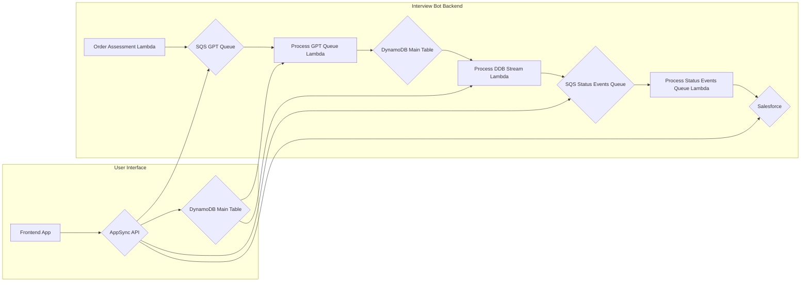

# Context Pack - Crossover: AI Assessments - L1

### Business Problem

Crossover want to use AI to create a set of low-pass filter assessments.

### Vision

Our vision is to create a streamlined assessment ordering and results delivery process that integrates seamlessly with Crossover's workflows and allows for efficient and accurate assessment management.

### How do we Win

- **Automated Ordering:** Eliminate manual processes for ordering assessments.
- **Real-time Updates:** Provide real-time updates on the status of assessments.
- **Automated Results Delivery:** Deliver results automatically to Crossover's systems.

### Important Business Decisions

- Choosing the right third-party vendors and assessments for Crossover's needs.
- Implementing a secure and reliable integration with the vendor's systems.

## Product Context

### Core Features

- **Order Assessments:** Allow Crossover to order assessments from third-party vendors through a REST API.
- **Manage Assessment Status:** Provide a GraphQL API for managing the status of assessments, including:
  - **Initializing:** The assessment is being prepared.
  - **Ready:** The assessment is ready to be taken.
  - **Started:** The candidate has started taking the assessment.
  - **Completed:** The candidate has finished taking the assessment.
  - **Graded:** The assessment has been graded, and results are available.
- **Deliver Results:** Send assessment results automatically to Crossover's systems via Salesforce.

### Important Functional Decisions

- **Security:** Implement robust security measures for the REST and GraphQL APIs, including authentication and authorization.
- **Scalability:** Ensure that the system can handle a high volume of assessments.
- **Reliability:** Implement error handling and retry mechanisms to ensure that assessments are processed reliably.

## Technical Context

### Tech Stack

- **Backend:** AWS Lambda with Node.js, AWS DynamoDB, AWS SQS, AWS SNS, AWS Step Functions.
- **Integration:** REST and GraphQL APIs, Salesforce API integration.
- **AI:** OpenAI GPT, Anthropic Claude models.
- **Database:** AWS DynamoDB.

### Technical Architecture

### Important Technical Decisions

- **Database Design:** Choose the appropriate database schema for storing assessment data.
- **Data Protection:** Protect sensitive information from unauthorized access.
- **Asynchronous Processing:** Leverage message queues (SQS) for efficient and scalable processing.
- **AI Model Selection:** Choose the appropriate AI models for different assessment tasks.

### Established Practices

- **Environment Variables:** Use environment variables for configuration.
- **Logging:** Implement robust logging to track assessment events and errors.

## Modules

- **Assessments**: Skills, Calibrated Questions, Questions, and Sessions.
- **Integration**: Ordering and Results Delivery.
- **Live Interviews**: Live interview support.
- **Cheating Detection**: Cheating detection.
- **Candidate Experience**: Frontend app for candidates.
