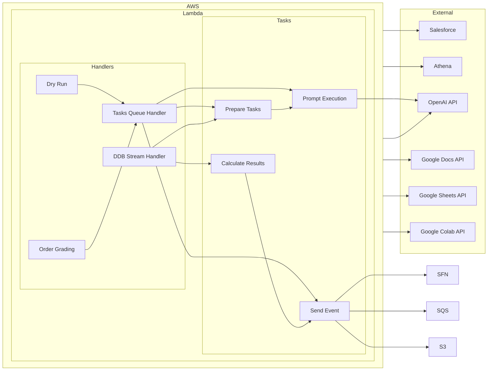

# Context Pack - Crossover: AI Grading - L1

## Business Context

### Business Problem

Grading submissions from candidates in XO-Hiring is time-consuming and prone to inconsistencies between different graders.

### Vision

Our vision is to use generative AI to automate the process of grading candidate submissions in XO-Hiring. This will enable the platform to scale more efficiently, reduce human effort, and guarantee consistent grading across all submissions.

### How do we Win

By automating the grading process, we can:

- **Increase Efficiency:** Reduce time spent on grading, freeing up time for other tasks.
- **Improve Consistency:** Ensure that all submissions are graded according to the same criteria.
- **Reduce Costs:** Lower the overall cost of grading.
- **Enhance Accuracy:** Leverage AI's ability to process complex information and provide more accurate assessments.

### Important Business Decisions

- **Selection of AI Model:** We need to choose a reliable and accurate AI model for grading.
- **Calibration:** We need to ensure that the AI model is properly calibrated to the specific grading criteria.
- **Integration with XO-Hiring:** Seamless integration with the platform is essential for a smooth user experience.
- **Feedback & Transparency:** We need to ensure that the AI-based grading process is transparent to users and that they receive valuable feedback.

## Product Context

### Core Features

- **Automatic Submission Grading:** The service automatically grades submissions based on defined grading criteria.
- **Support for Different Submission Formats:** The service supports grading submissions in various formats including Google Docs, SurveyMonkey responses, and other document types.
- **Integration with XO-Hiring:** Seamless integration with the XO-Hiring platform.

### Important Functional Decisions

- **Grading Logic:** We need to determine a robust and accurate way to translate the grading rules into AI prompts.
- **Calibration:** We need to develop a reliable mechanism for calibrating the AI model to the specific grading rules.
- **Error Handling:** We need to handle errors gracefully and provide appropriate feedback to users.
- **User Interface:** A user-friendly interface is needed to define grading rules and manage the process.

## Technical Context

### Tech Stack

The service is built using a combination of serverless technologies, AI services, and APIs.

### Technical Architecture

### Data Model

- **Main Table:** The main table in DynamoDB stores grading batches, grading tasks, and prompt execution tasks.
- **Grading Batches:** Each batch represents a set of grading tasks initiated through a dry-run request.
- **Grading Tasks:** Each task corresponds to a specific candidate submission and includes the submission details, grading rules, and grading results.
- **Prompt Execution Tasks:** Sub-tasks related to prompt execution for a specific grading rule.

### Important Technical Decisions

- **AWS Services Selection:** We have selected AWS Lambda, DynamoDB, SQS, and Step Functions as the core services for the application.
- **AI Model Selection:** We chose OpenAI's GPT model as the AI engine for grading.
- **Data Storage:** We have chosen DynamoDB as the primary data store for its scalability and flexibility.
- **Event-Driven Architecture:** The system is designed with an event-driven architecture, allowing for asynchronous task processing and efficient handling of concurrent requests.

### Established Practices

- **Code Organization:** We follow a modular approach to organize the codebase into logical components.
- **Logging:** Detailed logging is implemented throughout the code to track the execution flow and identify errors.
- **Testing:** Comprehensive unit and integration tests are written to ensure the service's functionality and stability.

### 3rd party services

- **OpenAI API:** Used to generate text completions for grading tasks.
- **Salesforce API:** Used to fetch grading rules, application step data, and for sending callback events.
- **Google APIs:** Used to fetch content from Google Docs, Google Sheets, and Google Colab.

### 3rd party libraries

- **`axios`:** Used to perform HTTP requests.
- **`openai`:** Used to interact with the OpenAI API.
- **`@aws-sdk/client-*`:** Used to interact with various AWS services.

### Established Practices

- **Environmental Variables:** Configuration is managed using environment variables.
- **Error Handling:** Robust error handling is implemented to handle unexpected issues and ensure smooth operation.
- **Code Style:** We adhere to a consistent code style for readability and maintainability.

### Environments

- **Sandbox:** Used for development and testing purposes.
- **Production:** The live environment where the service is deployed.

## Modules

- **Handlers:** Contains logic for handling incoming requests and processing tasks.
- **Integrations:** Provides interfaces for interacting with external services and AWS services.
- **Model:** Defines the data structures for storing grading batches, grading tasks, and prompt execution tasks.
- **Processors:** Contains logic for preparing prompts for the OpenAI API based on different grading modes.
- **Tasks:** Contains logic for processing various tasks like grading submission, sending events, and prompt execution.
- **Common:** Contains shared utility functions and error handling logic.
