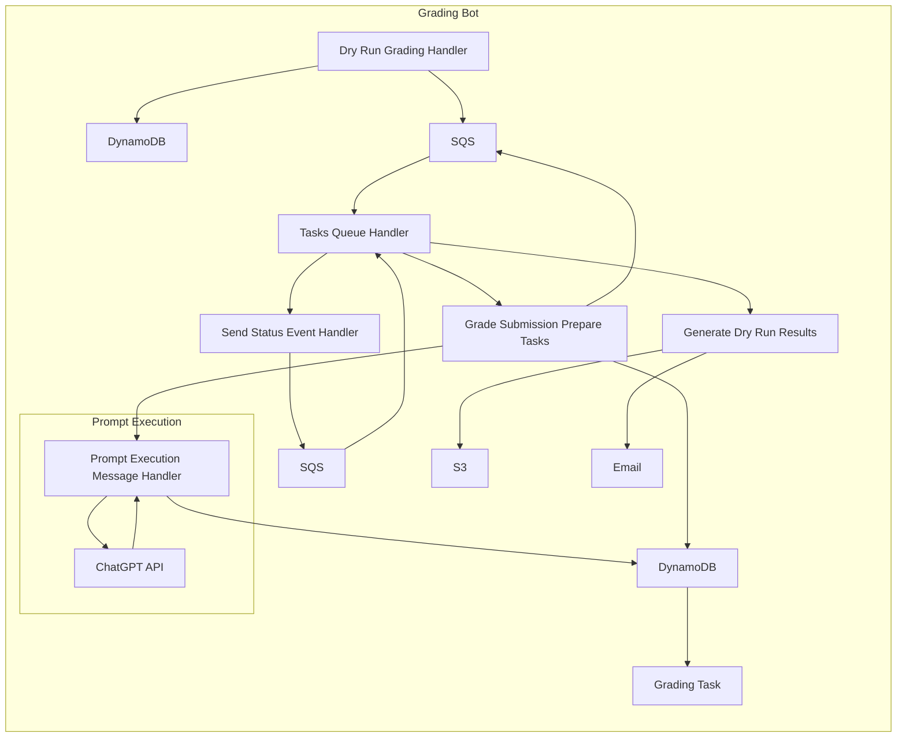

# Context Pack - Crossover: AI Grading - L2 - Grading Process

## Business Context

This Module handles the automation of the candidate submission grading process. It enables the creation of dry run grading batches, the ordering of grading tasks, and the processing of individual tasks. It uses various third-party services and libraries to perform its functions. The Module is critical for improving the efficiency and accuracy of the hiring process.

## Functional Context

This Module provides the following key functionalities:

1.  **Dry run grading**: Allows to create a "dry run" grading batch for a specific application step by providing start and end dates. The Module will then fetch the ASRs from Athena and create grading tasks based on the available data and grading rules.
2.  **Order grading**: Allows to order grading tasks individually by providing information about submission links, application step result IDs, and other relevant data.
3.  **Process grading tasks**: Each grading task is processed individually by extracting relevant content, selecting the appropriate grading rules, and generating prompts for the GPT-based grading engine.

### Important Functional Decisions

1.  **Modular approach**: The Module is designed as a set of independent functions and handlers, making it easier to maintain and scale.
2.  **Flexibility in content extraction**: The Module can extract content from various data sources, including Google Docs, Google Sheets, and SurveyMonkey responses.
3.  **Support for different grading modes**: The Module supports different grading modes, including unstructured grading, structured grading using table sections, and grading based on SurveyMonkey responses.
4.  **Delayed status event processing**: To avoid overloading the client with immediate responses, the Module uses a delayed queue to process status events.

## Technical Context

### Tech Stack

The Module uses the following technologies:

- AWS Lambda
- AWS DynamoDB
- AWS SQS
- AWS SES
- AWS Step Functions
- AWS Athena
- AWS Secrets Manager
- OpenAI API
- Google Drive API
- Salesforce API

### Architecture

This diagram represents a high-level overview of the Module's architecture. The Dry Run Grading Handler is responsible for receiving requests, querying data from Salesforce and Athena, creating Grading Tasks, and sending them to the Tasks Queue. The Tasks Queue Handler is responsible for processing these tasks. The Grade Submission Prepare Tasks function extracts content from the submissions, generates prompts for the GPT-based grading engine, and queues these prompts. The Prompt Execution Message Handler is responsible for sending prompts to the OpenAI API and saving the results back to the DynamoDB. The Send Status Event Handler is responsible for sending status events to the callback URL. The Generate Dry Run Results function is responsible for generating CSV reports and sending them to the recipient email.

### Data Model

**DynamoDB:**

- **Grading Batch:** Stores information about each dry run grading batch, including the application step ID, start and end dates, and the recipient email.
- **Grading Task:** Stores information about each individual grading task, including the submission link, grading rules, the status, the grading results, and the callback URL.
- **Prompt Execution Task:** Stores information about each prompt sent to the OpenAI API, including the prompt, the AI response, and the status.

**Salesforce:**

- **Application Step:** Stores information about each application step, including the grading mode.
- **Grading Rule:** Stores information about each grading rule, including the rule itself, pass and fail examples, and the application step ID.

**Athena:**

- **Application Step Result:** Stores information about each candidate submission, including the submission time, the score, and the grader.

### Important Technical Decisions

1.  **Leveraging AWS services**: The Module heavily relies on various AWS services, including Lambda, DynamoDB, SQS, SES, Step Functions, Athena, and Secrets Manager. This allows the Module to be highly scalable and secure.
2.  **Asynchronous task processing**: The Module processes grading tasks asynchronously using SQS. This allows the Module to handle a large number of tasks without blocking the main thread.
3.  **Delayed status event processing**: The Module uses Step Functions to delay the processing of status events. This prevents the client from being overloaded with immediate responses.
4.  **Handling errors**: The Module handles errors gracefully by retrying failed tasks and logging all errors.

### Established Practices

- **Code organization**: The Module follows a modular approach, with each functionality implemented in a separate file.
- **Logging**: The Module utilizes a custom logger to log all important events, errors, and debugging information.
- **Unit testing**: The Module is thoroughly unit tested to ensure code quality and stability.

### 3rd party services

- **OpenAI API**: Used to grade candidate submissions using GPT-based models.
- **Google Drive API**: Used to fetch the content of Google Docs and Colab notebooks.
- **Salesforce API**: Used to fetch information about application steps and grading rules.
- **SurveyMonkey API**: Used to fetch responses from SurveyMonkey surveys.

### 3rd party libraries

- **Handlebars**: Used to template the prompts for the GPT-based grading engine.
- **axios**: Used to perform HTTP requests to third-party services.
- **objects-to-csv**: Used to generate CSV reports.
- **escape-string-regexp**: Used to escape strings for regular expression matching.

## Functions

- **`handler` in `grading-bot/src/handlers/dryRunGradingHandler.ts`**: Handles the dry run grading requests, fetches data from Salesforce and Athena, creates Grading Tasks, and sends them to the Tasks Queue.
- **`handler` in `grading-bot/src/handlers/orderGradingHandler.ts`**: Handles the ordering of grading tasks, creates Grading Tasks, and sends them to the Tasks Queue.
- **`handler` in `grading-bot/src/handlers/tasksQueueHandler.ts`**: Handles the processing of Grading Tasks, including content extraction, prompt generation, GPT execution, and sending status events.
- **`handleCompletedBatchResults` in `grading-bot/src/tasks/generate-dry-run-results.ts`**: Generates CSV reports and sends them to the recipient email when a dry run grading batch is completed.
- **`gradeSubmissionPrepareTasks` in `grading-bot/src/tasks/grade-submission-prepare-tasks.ts`**: Prepares prompt execution tasks for individual grading tasks.
- **`gradeSubmissionCalculateResult` in `grading-bot/src/tasks/grade-submissions-calculate-result.ts`**: Calculates the final grading result for a task based on the GPT responses and updates the status of the task.
- **`processPromptExecutionMessage` in `grading-bot/src/tasks/process-prompt-execution-message.ts`**: Processes the prompt execution message from the Tasks Queue, sends the prompt to OpenAI, saves the result, and updates the status of the prompt execution task.
- **`delayCallbackEvent` in `grading-bot/src/tasks/send-status-event.ts`**: Sends the status event to the callback URL after a delay.
- **`sendErrorEvent` in `grading-bot/src/tasks/send-status-event.ts`**: Sends an error event to the callback URL.
- **`sendCallbackEvent` in `grading-bot/src/tasks/send-status-event.ts`**: Sends the status event to the callback URL when a task is completed.
- **`extractContent` in `grading-bot/src/processors/extract-content.ts`**: Extracts the content from various data sources, including Google Docs, Google Sheets, and SurveyMonkey responses.
- **`prepareSMResponsesPrompt` in `grading-bot/src/processors/sm-response.ts`**: Generates prompts for the GPT-based grading engine for SurveyMonkey responses.
- **`prepareStructuredTablePrompt` in `grading-bot/src/processors/table-sections-google-doc.ts`**: Generates prompts for the GPT-based grading engine for structured grading using table sections from Google Docs.
- **`prepareDefaultPrompt` in `grading-bot/src/processors/unstructured-google-doc.ts`**: Generates prompts for the GPT-based grading engine for unstructured grading from Google Docs.
