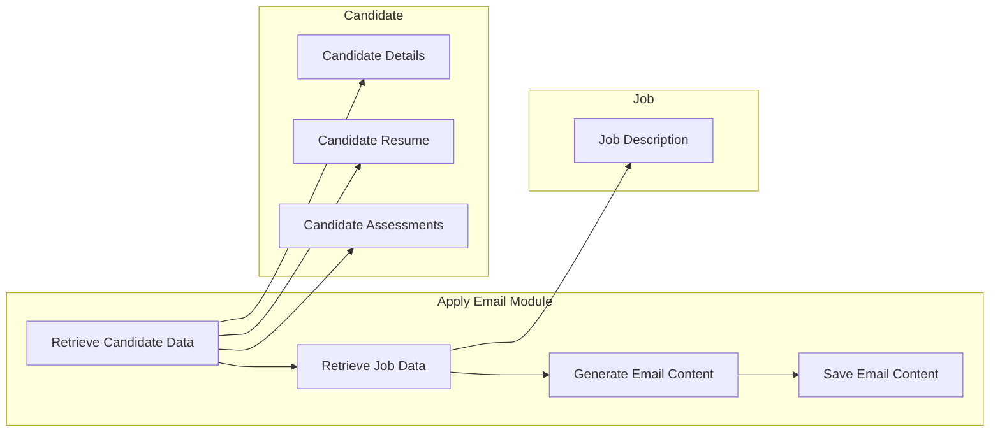

# Context Pack - XOHire: Candidate Experience - L2 - Apply Email

## Business Context

This module is responsible for generating email content for applying to a specific job. It uses a custom AI model to personalize the email based on the candidate's resume, profile, and assessments. The email is then sent to the candidate to encourage them to apply for the job.

## Functional Context

The module is triggered when a candidate attempts to apply for a job. It retrieves the candidate's profile, resume, and assessment data, as well as the job description, from the database. It then uses an AI model to generate email content based on this information. The email is then delivered to the candidate.

### Important Functional Decisions

- The email content generation is delegated to a custom AI model for a more personalized touch.
- The task is asynchronously processed using DynamoDB stream.

## Technical Context

### Tech Stack

- **DynamoDB**: Used to store and manage AI-related tasks.
- **Bedrock**: Used to access and run the AI model.
- **Claude Sonnet**: Used to generate email content.

### Architecture

### Important Technical Decisions

- The email content is generated in a way that is both effective and engaging for the candidate.
- The AI model is selected and configured for optimal performance.

### 3rd party services

- **Bedrock**: Used to run the AI model
- **Claude Sonnet**: Used to generate email content

### 3rd party libraries

- **Handlebars**: Used to template the prompt
- **@aws-sdk/client-bedrock-runtime**: Used to interact with Bedrock
- **@trilogy-group/xo-hiring-integration**: Used to access Salesforce

## Functions

- **Apply Email Content Generator**: Generates email content for applying to a specific job.

This module uses an AI model to personalize the email based on the candidate's resume, profile, and assessments. This makes the email more effective and engaging for the candidate. The email is then delivered to the candidate to encourage them to apply for the job.

The module is triggered when a candidate attempts to apply for a job. It retrieves the candidate's profile, resume, and assessment data, as well as the job description, from the database. It then uses an AI model to generate email content based on this information. The email is then delivered to the candidate.
