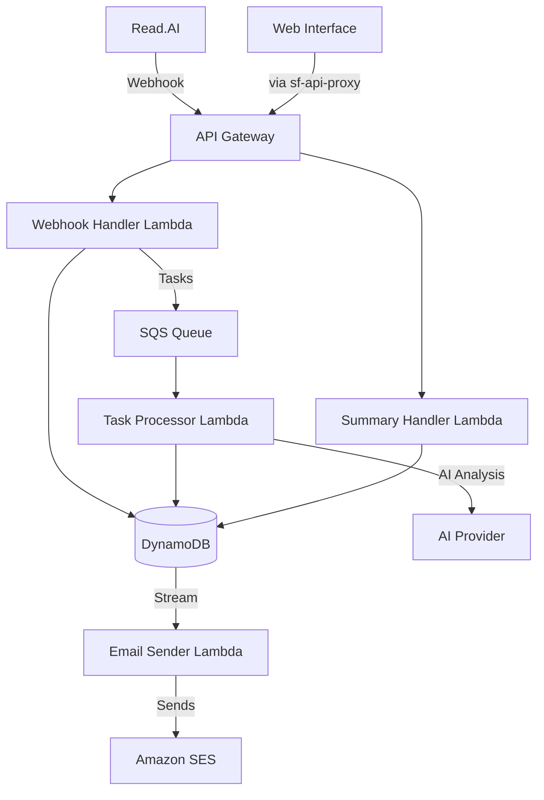
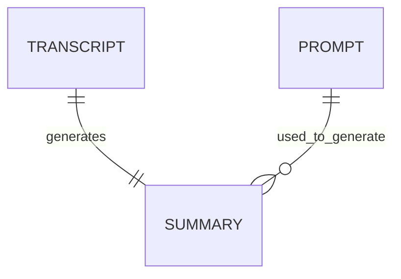

# Context Pack - Crossover: Hire - L2 - Interview Assistant

## Business Context

The Interview Assistant module addresses critical inefficiencies in the interview feedback process at Crossover. It aims to solve problems like scarce rejection feedback, vague rejection reasons, and misalignment between candidate qualifications and job requirements. These issues currently lead to reduced satisfaction for both candidates and hiring managers, inefficient use of interview time, and decreased trust in the hiring process.

## Functional Context

The module provides several key functions:

- Automated capture of interview content through Read.AI integration
- AI-powered analysis of interview transcripts to extract key insights
- Generation of comprehensive interview summaries focusing on specific acceptance/rejection reasons
- Storage and retrieval of interview data and summaries
- Automated email distribution system for interview summaries
- Reminder system to ensure proper Read.AI webhook setup

Users interact with the module through:

- Automated Read.AI webhook for interview capture
- Web interface for viewing detailed interview summaries
- Automated email notifications containing analysis results and relevant links
- Integration with existing XO Hire candidate assessment workflow

### Important Functional Decisions

1. Separating interview transcript processing from summary generation to allow independent scaling
2. Using Read.AI for interview capture to leverage existing enterprise tooling
3. Implementing a reminder system to ensure proper webhook setup and data collection
4. Storing both raw transcripts and generated summaries for future reference and improvement
5. Implementing an automated email distribution system to ensure key stakeholders receive timely interview summaries

## Technical Context

### Tech Stack

- AWS Lambda (Node.js 20.x) for serverless compute
- Amazon DynamoDB for data storage
- AWS API Gateway for REST endpoints
- SQS for async task processing
- Read.AI integration for interview capture
- Amazon Bedrock/OpenAI for AI analysis
- Amazon SES for email delivery
- DynamoDB Streams for event-driven notifications

### Architecture

### Data Model

### Important Technical Decisions

1. Using serverless architecture for:

   - Automatic scaling based on load
   - Cost optimization
   - Independent function deployment

2. Implementing asynchronous processing through SQS to:

   - Handle processing failures gracefully
   - Allow retries of failed operations
   - Decouple webhook handling from AI processing

3. Supporting multiple AI providers (OpenAI/Bedrock) to:

   - Avoid vendor lock-in
   - Enable cost optimization
   - Support different use cases

4. Using DynamoDB streams for email notifications to:
   - Ensure reliable delivery of interview summaries
   - Maintain loose coupling between summary generation and notification
   - Enable batch processing of notifications
   - Support automatic retries on failure

### Established Practices

1. Lambda Function Organization:

   - Handlers in separate directory
   - Business logic in tasks directory
   - Models for data access layer
   - Integrations for external services

2. Error Handling:
   - Consistent error logging through xoh-integration
   - Proper error responses in API
   - SQS dead-letter queue for failed tasks

### 3rd party services

- Read.AI - Interview transcription and real-time analysis service
- OpenAI/Amazon Bedrock - AI providers for transcript analysis and summary generation
- Amazon SES - Email delivery service

### 3rd party libraries

- @ai-sdk/\* - AI provider integration libraries
- @aws-sdk/client-dynamodb - AWS DynamoDB client
- @aws-sdk/client-ses - AWS SES client for email sending
- dynamodb-toolbox - DynamoDB data modeling
- @trilogy-group/xoh-integration - Shared integration utilities
- luxon - Date/time handling
- nodemailer - Email composition and sending
- handlebars - Email template rendering
- marked - Markdown to HTML conversion for emails

## Functions

1. Read.AI Webhook Processing - Receives and stores interview transcripts
2. Task Processing - Handles asynchronous processing of interviews
3. Summary Generation - Creates AI-powered interview summaries
4. Summary Retrieval - Provides access to stored interview summaries
5. Email Notification System:
   - Triggered by DynamoDB streams on new summary creation
   - Sends formatted HTML emails containing:
     - Interview summary (converted from markdown)
     - Links to Read.AI recording and grading interface
     - Contextual information (candidate, position, etc.)
   - Distribution:
     - To: Interview grader
     - CC: Hiring manager and primary hiring manager
   - Uses AWS SES for delivery with retry capability
6. Notification System - Sends reminders for webhook setup
