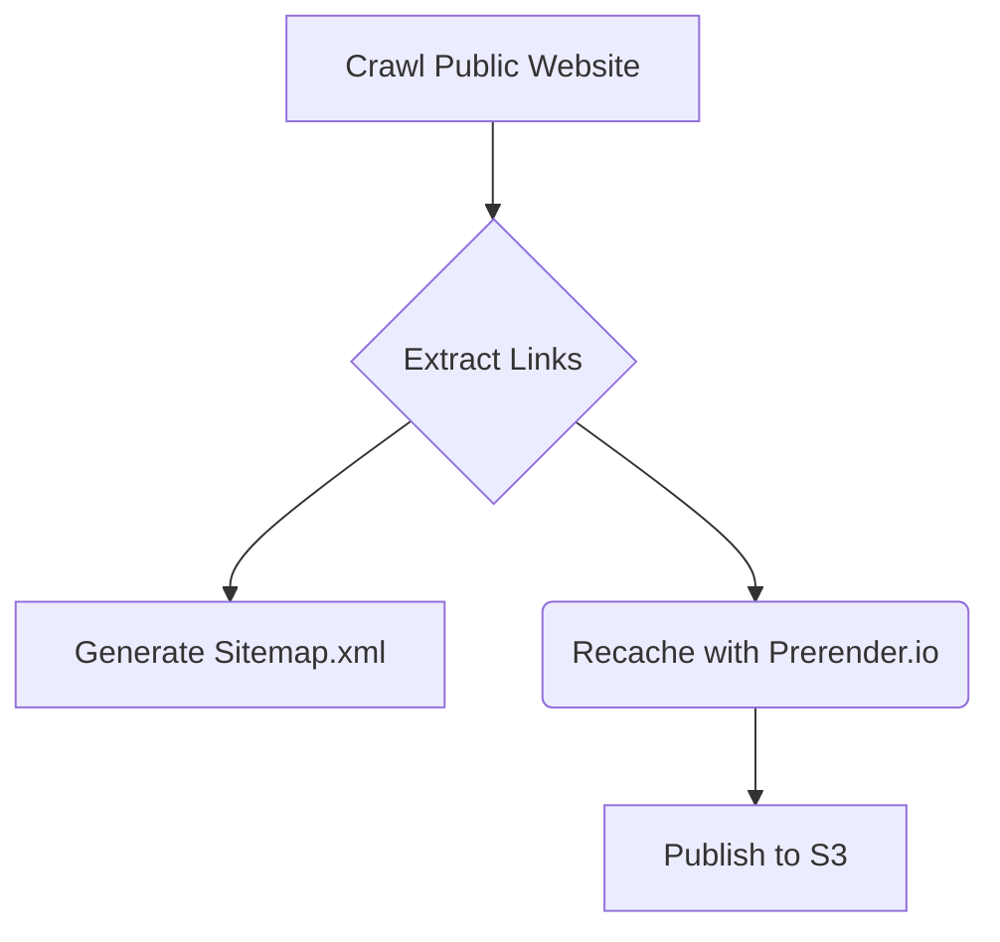

# Context Pack - Crossover: Hire - L2 - Sitemap Generator

## Business Context

The Public Site - Sitemap Generator module generates and publishes a sitemap for the public website, enabling search engines to effectively crawl and index the website's content. This improves website visibility and organic search ranking.

## Functional Context

The module crawls the public website, starting from a defined root URL. It identifies and collects all valid links, ignoring specific patterns defined in the configuration. The module then generates a sitemap.xml file containing all collected URLs and publishes it to the designated AWS S3 bucket. Optionally, it can also register these URLs with the Prerender.io service to optimize website performance by pre-rendering pages for faster loading.

### Important Functional Decisions

- **Crawling Depth:** The module determines the depth of crawling based on the structure of the website and the specified ignore patterns. This ensures a comprehensive sitemap without excessive crawl time.
- **Prerender Integration:** The module leverages the Prerender.io service for pre-rendering pages, optimizing user experience and search engine indexing.

## Technical Context

### Tech Stack

The module utilizes the following technologies:

- **Node.js:** The module is built using Node.js, a popular JavaScript runtime environment.
- **Puppeteer:** A headless Chrome browser library used to crawl the website and extract links.
- **Axios:** A promise-based HTTP client for making requests to Prerender.io and AWS S3.
- **AWS SDK:** Used to interact with AWS services like S3 and Secrets Manager.
- **Lodash:** A utility library used for array manipulation, specifically for chunking URLs for Prerender.io requests.
- **Zod:** A schema validation library for validating the configuration.
- **TypeScript:** For type safety and code organization.

### Architecture

The module follows a simple architecture. It first crawls the website, extracts valid links, and then generates a sitemap.xml file. Optionally, the module can register URLs with Prerender.io for performance optimization. Finally, the generated sitemap.xml file is published to the designated S3 bucket.

### Data Model

The module primarily deals with the following data:

- **URLs:** A collection of valid URLs discovered during the crawling process.
- **Sitemap.xml:** A structured XML file containing the URLs of the website for search engines to index.
- **Configuration:** A set of parameters controlling the crawling behavior, including ignored patterns, Prerender token, and S3 bucket details.

### Important Technical Decisions

- **Headless Chrome:** Utilizing Puppeteer with headless Chrome allows for efficient crawling without opening a browser window.
- **URL Chunks:** Chunking URLs for Prerender.io requests prevents exceeding API rate limits.
- **Error Handling:** Robust error handling is implemented to gracefully handle potential issues during crawling, generation, and publishing.

### Established Practices

- **Configuration Management:** The module uses AWS Systems Manager Parameter Store for managing configuration parameters, ensuring consistency and security.
- **Logging:** Detailed logging is implemented throughout the module to track the crawling process, including ignored URLs and Prerender.io responses.

### 3rd party services

- **Prerender.io:** Used for pre-rendering pages to improve user experience and search engine indexing.
  [https://prerender.io/](https://prerender.io/)
- **AWS S3:** Used to publish the generated sitemap.xml file.
  [https://aws.amazon.com/s3/](https://aws.amazon.com/s3/)

### 3rd party libraries

- **Puppeteer:** A headless Chrome browser library used to crawl the website and extract links.
  [https://pptr.dev/](https://pptr.dev/)
- **Axios:** A promise-based HTTP client for making requests to Prerender.io and AWS S3.
  [https://axios-http.com/docs/api_intro](https://axios-http.com/docs/api_intro)
- **AWS SDK:** Used to interact with AWS services like S3 and Secrets Manager.
  [https://aws.amazon.com/sdk-for-javascript/](https://aws.amazon.com/sdk-for-javascript/)
- **Lodash:** A utility library used for array manipulation, specifically for chunking URLs for Prerender.io requests.
  [https://lodash.com/](https://lodash.com/)
- **Zod:** A schema validation library for validating the configuration.
  [https://zod.dev/](https://zod.dev/)

## Functions

- **`handler()`:** The main function of the module, responsible for orchestrating the entire crawling, sitemap generation, and publication process.
  [https://github.com/your-github-account/your-repo/blob/main/site-recacher/src/index.ts](https://github.com/your-github-account/your-repo/blob/main/site-recacher/src/index.ts)
- **`visitUrl()`:** A recursive function that crawls the website, following links and extracting URLs.
  [https://github.com/your-github-account/your-repo/blob/main/site-recacher/src/index.ts](https://github.com/your-github-account/your-repo/blob/main/site-recacher/src/index.ts)
- **`getPrerenderSecret()`:** Retrieves the Prerender.io token from AWS Secrets Manager.
  [https://github.com/your-github-account/your-repo/blob/main/site-recacher/src/index.ts](https://github.com/your-github-account/your-repo/blob/main/site-recacher/src/index.ts)
- **`recache()`:** Registers URLs with Prerender.io for pre-rendering.
  [https://github.com/your-github-account/your-repo/blob/main/site-recacher/src/index.ts](https://github.com/your-github-account/your-repo/blob/main/site-recacher/src/index.ts)
- **`generateSitemap()`:** Generates the sitemap.xml file based on the collected URLs.
  [https://github.com/your-github-account/your-repo/blob/main/site-recacher/src/index.ts](https://github.com/your-github-account/your-repo/blob/main/site-recacher/src/index.ts)
- **`publishSitemap()`:** Publishes the generated sitemap.xml file to the designated S3 bucket.
  [https://github.com/your-github-account/your-repo/blob/main/site-recacher/src/index.ts](https://github.com/your-github-account/your-repo/blob/main/site-recacher/src/index.ts)
