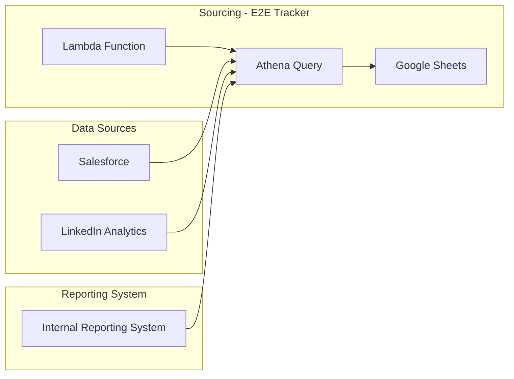

# Context Pack - Crossover: Hire - L2 - Sourcing - E2E Tracker

## Business Context

This module provides a comprehensive view of the candidate conversion pipeline, from LinkedIn ad impressions to hired candidates, helping to identify bottlenecks and optimize sourcing strategies.

It is used by the sourcing team to track the effectiveness of their campaigns and make data-driven decisions about their strategies.

The module helps to:

- Measure the impact of LinkedIn ads on the hiring process.
- Identify areas for improvement in the candidate journey.
- Optimize sourcing strategies for greater efficiency and ROI.

## Functional Context

The module processes data from a variety of sources, including Salesforce, LinkedIn Analytics, and an internal reporting system. It then aggregates this data and presents it in a clear and concise format, allowing users to easily understand the performance of their sourcing campaigns.

The module calculates key metrics such as:

- Conversion rate at each stage of the candidate journey.
- Cost per hire.
- Time to hire.

Users interact with the module through a Google Sheet, which is updated with the latest data on a regular basis. This sheet is accessible to the sourcing team, allowing them to view the performance of their campaigns in real time.

Other modules interact with the module to obtain data about the performance of sourcing campaigns. This data is used to inform decisions about resource allocation, campaign budgets, and other aspects of the hiring process.

### Important Functional Decisions

- **Data Aggregation:** The module aggregates data from multiple sources to provide a holistic view of the candidate journey.
- **Data Visualization:** The module presents data in a clear and concise format, making it easy for users to understand the performance of their sourcing campaigns.
- **Data Automation:** The module automatically updates the Google Sheet with the latest data, eliminating the need for manual data entry.

## Technical Context

### Tech Stack

The module uses a variety of technologies, including:

- AWS Lambda
- AWS Athena
- Google Sheets API
- Salesforce API
- Node.js
- Zod

### Architecture

The module is composed of the following components:

### Data Model

The module leverages the existing data models in Salesforce, LinkedIn Analytics, and the internal reporting system.

It combines this data to create a unified view of the candidate journey, including data points such as:

- Candidate source
- Stage of the hiring process
- Time spent at each stage
- Outcome of the candidate application

### Important Technical Decisions

- **AWS Lambda for Automation:** The module uses an AWS Lambda function to automatically update the Google Sheet with the latest data.
- **Athena for Querying:** The module uses AWS Athena to query data from Salesforce, LinkedIn Analytics, and the internal reporting system.
- **Google Sheets API for Data Presentation:** The module uses the Google Sheets API to present the data in a clear and concise format.

### Established Practices

- **Code Organization:** The module follows the established coding practices for the Stats Tracker product.
- **Testing:** The module is fully unit tested and integrated tested.
- **Logging:** The module uses the standard logging mechanisms for the Stats Tracker product.

### 3rd party services

- **AWS Secrets Manager:** Used to securely store and retrieve sensitive credentials for access to various data sources.
- **Google Sheets:** Used to display the aggregated data to the sourcing team.

### 3rd party libraries

- **AWS SDK:** Used to interact with AWS services such as Lambda and Athena.
- **googleapis:** Used to interact with Google Sheets and Drive APIs.
- **zod:** Used to validate data and enforce type safety.
- **lodash:** Used to manipulate data structures.
- **moment:** Used to manipulate dates and times.

## Functions

- **`handler`:** The main Lambda function that orchestrates the data processing and sheet rendering. (L3 - stats-tracker/tracker-refresher/src/index.ts)
- **`startQuery`:** Starts an Athena query execution. (L3 - stats-tracker/tracker-refresher/src/index.ts)
- **`waitForQueryResults`:** Waits for the completion of an Athena query execution and retrieves the results. (L3 - stats-tracker/tracker-refresher/src/index.ts)
- **`getEnvConfig`:** Retrieves configuration values from AWS Secrets Manager. (L3 - stats-tracker/tracker-refresher/src/index.ts)
- **`getOpportunitiesQuery`:** Generates the Athena query to retrieve data from Salesforce, LinkedIn Analytics, and the internal reporting system. (L3 - stats-tracker/tracker-refresher/src/get-opportunities-query.ts)
- **`renderSheet`:** Renders the data to the Google Sheet. (L3 - stats-tracker/tracker-refresher/src/render-sheet.ts)
- **`getSheet`:** Retrieves a sheet from a Google Spreadsheet. (L3 - stats-tracker/tracker-refresher/src/render-sheet.ts)
- **`createNewSpreadsheet`:** Creates a new Google Spreadsheet and shares it with "anyone with the link" as commenter. (L3 - stats-tracker/tracker-refresher/src/render-sheet.ts)
- **`editSheet`:** Updates the Google Sheet with the latest data. (L3 - stats-tracker/tracker-refresher/src/render-sheet.ts)
- **`getWeekTables`:** Generates a table structure from the data. (L3 - stats-tracker/tracker-refresher/src/render-sheet.ts)
- **`allTableRows`:** Generates a list of rows for a table. (L3 - stats-tracker/tracker-refresher/src/render-sheet.ts)
- **`allTablesRows`:** Generates a list of rows for all tables. (L3 - stats-tracker/tracker-refresher/src/render-sheet.ts)
- **`firstDataRowIndex`:** Returns the first data row index for a table. (L3 - stats-tracker/tracker-refresher/src/render-sheet.ts)
- **`lastDataRowIndex`:** Returns the last data row index for a table. (L3 - stats-tracker/tracker-refresher/src/render-sheet.ts)
- **`sumRowIndex`:** Returns the sum row index for a table. (L3 - stats-tracker/tracker-refresher/src/render-sheet.ts)
- **`lastRowIndex`:** Returns the last row index for a table. (L3 - stats-tracker/tracker-refresher/src/render-sheet.ts)
- **`convertType`:** Converts an Athena data type to a Google Sheet data type. (L3 - stats-tracker/tracker-refresher/src/render-sheet.ts)
