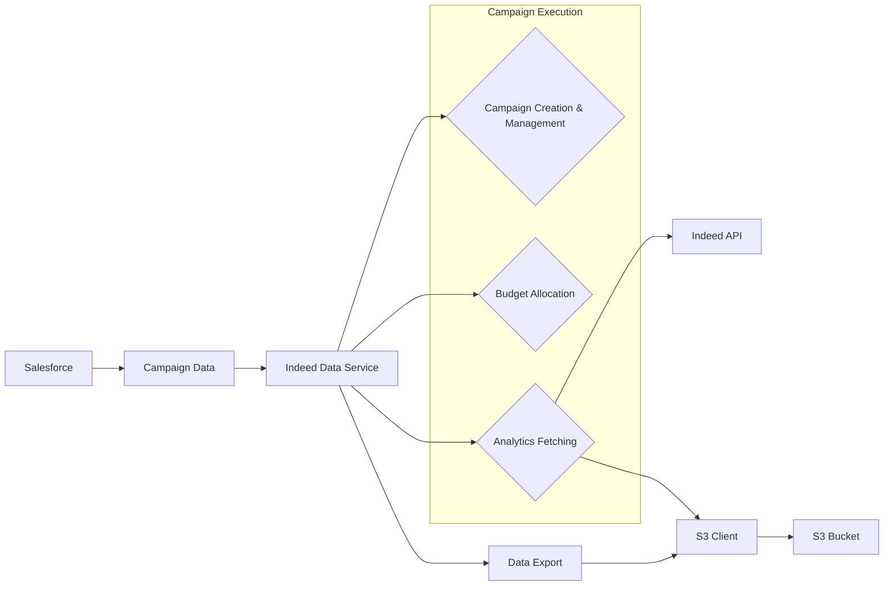

# Context Pack - Crossover: Hire - L2 - Sourcing - Indeed

## Business Context

The "Sourcing - Indeed" module facilitates candidate sourcing from the Indeed platform.
It automates crucial tasks such as campaign setup, budget allocation, performance tracking,
and data export to ensure effective and efficient talent acquisition efforts.
This module is essential for optimizing recruiting processes by simplifying the interaction with the Indeed platform.

## Functional Context

The module's primary functions include:

- **Campaign Management:** This involves creating and managing sponsored campaigns on Indeed, setting budgets, defining targeting criteria, and scheduling campaign duration.
- **Budget Allocation:** The module automatically allocates budget across various campaigns based on pre-defined rules and strategies to maximize return on investment.
- **Analytics and Reporting:** The module fetches performance data from Indeed and provides insights into campaign effectiveness. Key metrics include clicks, apply starts, applies, cost per click, and overall cost.
- **Data Export:** The module exports analytics data in a CSV format to S3 for further analysis and reporting.

### Important Functional Decisions

- **Automated Campaign Management:** To streamline the sourcing process and eliminate manual intervention.
- **Intelligent Budget Allocation:** Utilizing rules and algorithms to optimize budget allocation across campaigns.
- **Comprehensive Analytics:** Providing rich and actionable insights into campaign performance.
- **Data Integration with Other Systems:** Enabling seamless integration with other systems through data exports.

## Technical Context

### Tech Stack

The module is built using a combination of:

- **TypeScript:** For robust type-checking and code maintainability.
- **Node.js:** As the runtime environment for serverless functions.
- **AWS Lambda:** To execute serverless functions triggered by events or schedule.
- **AWS S3:** For storing exported data and other assets.
- **AWS DynamoDB:** For persisting data related to sessions and questions.
- **Indeed API:** Interacting with the Indeed platform to manage campaigns and retrieve analytics.
- **Salesforce:** For integration with CRM and retrieving campaign data.
- **Luxon:** For handling date and time manipulation.
- **csv-stringify:** For converting data to CSV format.
- **xmlbuilder:** For building Indeed XML feed.

### Architecture

### Data Model

The module primarily interacts with the following data models:

- **Campaign:** Represents a sponsored campaign on Indeed, including its ID, name, budget, targeting criteria, and schedule.
- **Analytics:** Stores performance data collected from Indeed, such as clicks, apply starts, applies, cost per click, and overall cost.
- **Session:** Represents an interview session for a candidate, including the session ID, skill, question details, answers, and grading data.
- **Question:** Represents a question in an interview session, including the question itself, the candidate's answer, and the GPT-generated grading result.

### Important Technical Decisions

- **Serverless Architecture:** Leveraging AWS Lambda for scalability and cost-efficiency.
- **Data Persistence:** Utilizing AWS DynamoDB for robust and reliable data storage.
- **S3 Integration:** Leveraging S3 for secure data storage and efficient data transfers.
- **API Communication:** Using the Indeed API for seamless interactions with the Indeed platform.

### Established Practices

- **Code Style and Linting:** Adhering to established code style guidelines and using linting tools to maintain consistency.
- **Error Handling:** Implementing robust error handling mechanisms to ensure system stability.
- **Unit Testing:** Writing unit tests for critical components to guarantee code functionality.
- **Code Review:** Enforcing code review processes to improve code quality and prevent regressions.

### 3rd party services

- **Indeed API:** Used to interact with the Indeed platform to create, manage, and get data from campaigns. [https://developers.indeed.com/docs/api](https://developers.indeed.com/docs/api)

### 3rd party libraries

- **axios:** Used for making HTTP requests to the Indeed API. [https://axios-http.com/docs/api_intro](https://axios-http.com/docs/api_intro)
- **luxon:** Used for handling date and time manipulation. [https://moment.github.io/luxon/](https://moment.github.io/luxon/)
- **csv-stringify:** Used for converting data to CSV format. [https://www.npmjs.com/package/csv-stringify](https://www.npmjs.com/package/csv-stringify)
- **xmlbuilder:** Used for building Indeed XML feed. [https://www.npmjs.com/package/xmlbuilder](https://www.npmjs.com/package/xmlbuilder)

## Functions

- **`indeed-allocate-budget.ts`:** Allocates budget to Indeed campaigns based on pre-defined rules and strategies.
- **`indeed-disposition.ts`:** Handles dispositions of candidates from Indeed platform by updating Salesforce and sending disposition data to Indeed API.
- **`indeed-feed-generator.ts`:** Generates Indeed XML feed based on data from Salesforce and configuration parameters.
- **`indeed-fetch-analytics.ts`:** Fetches analytics data from Indeed and exports it to S3 in CSV format.
- **`indeed-post-weekly-jobs.ts`:** Executes weekly job posting process, including selection of jobs, campaign creation, and budget allocation.
- **`indeed-publish-weekly-jobs.ts`:** Publishes weekly jobs on Indeed by updating Salesforce and triggering feed generation.
