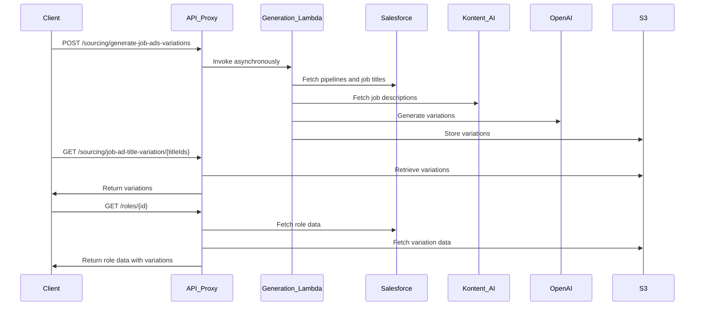

# Context Pack - Crossover: Hire - Sourcing - L2 - Job Ad Title Variations

## Business Context

The "Job Ad Title Variations" module addresses the need to create engaging and unique job advertisements to attract high-quality candidates. By generating diverse variations of job titles and descriptions, this module helps the sourcing team enhance job postings, making them stand out in the job market and appealing to a broader audience. Leveraging AI technologies reduces manual effort and introduces creativity into job postings, ultimately improving candidate engagement and application rates.

## Functional Context

This module provides the following key functions:

- **Generation of Job Ad Title Variations**: Utilizes AI language models to generate varied and creative job ad titles and descriptions based on existing job data.
- **Retrieval of Generated Variations**: Allows retrieval of previously generated job ad title variations through API endpoints.
- **Integration with External Systems**: Fetches existing job titles and descriptions from Salesforce and Kontent AI CMS to ensure consistency and leverage current data.
- **Storage of Variations**: Stores generated variations in an S3 bucket for efficient retrieval and management.

Users (internal team members or automated systems) can interact with this module through API endpoints to trigger the generation process or to retrieve the generated variations. Other modules can integrate with it to enhance job postings with varied content.

### Important Functional Decisions

- **Use of AI for Content Generation**: Decided to leverage AI language models (e.g., OpenAI's GPT) to automate the creation of job ad variations, enhancing creativity and efficiency.
- **Asynchronous Processing**: Implemented the generation process as asynchronous to prevent blocking operations during API calls, improving performance and scalability.
- **Decoupling Storage and Processing**: Chose to store generated variations in an S3 bucket, separating generation from retrieval and allowing for flexible data management.
- **Enhancement of Existing Endpoints**: Updated the `/roles/{id}` endpoint to include variation data, providing enriched information without altering existing workflows.

## Technical Context

### Tech Stack

- **Programming Language**: TypeScript
- **AWS Services**:
  - **Lambda Functions**: Serverless computing for generation logic.
  - **S3**: Storage of generated job ad title variations.
  - **API Gateway**: Exposes API endpoints.
- **External APIs and SDKs**:
  - **Salesforce API**: Fetches active pipelines and job titles.
  - **Kontent AI Delivery SDK**: Retrieves original job descriptions from the CMS.
  - **OpenAI API**: Generates content using AI language models.
- **Libraries**:
  - **@aws-sdk/client-s3**: AWS SDK for S3 operations.
  - **@kontent-ai/delivery-sdk**: SDK for interacting with Kontent AI CMS.
  - **@trilogy-group/xoh-integration**: Provides integrations and logging utilities.
  - **Axios**: HTTP client for API requests.

### Architecture

The module's architecture involves several components working together:

- **Generation Lambda Function** (`generate-job-ads-title-variations`):

  - Fetches active pipelines and job titles from Salesforce.
  - Retrieves job descriptions from Kontent AI CMS.
  - Uses OpenAI's GPT models to generate variations.
  - Stores the generated variations in an S3 bucket.

- **API Endpoints** (exposed via `api-proxy`):

  - **POST `/sourcing/generate-job-ads-variations`**: Triggers the generation Lambda function asynchronously.
  - **GET `/sourcing/job-ad-title-variation/{titleIds}`**: Retrieves generated variations from S3 for specified job title IDs.
  - **GET `/roles/{id}`**: Enhanced to include job ad title variation data in its response.

- **Data Flow**:
  - Request to trigger generation is received.
  - Lambda function processes data and generates variations.
  - Variations are stored in S3.
  - Retrieval endpoints access S3 to provide variations to clients.

#### Sequence Diagram

### Data Model

- **S3 Storage**: Variations are stored as JSON files in an S3 bucket, keyed by job title ID. The JSON structure mirrors the sections of the job description (e.g., hook, responsibilities, requirements).
- **Salesforce Integration**: Job titles and pipeline data are fetched, providing IDs and codes necessary for fetching descriptions and generating variations.
- **Kontent AI Data**: Original job descriptions are retrieved from Kontent AI CMS to serve as the basis for generating new variations.

### Important Technical Decisions

- **Asynchronous Lambda Invocation**: Chose to invoke the generation Lambda asynchronously via the POST endpoint to avoid client timeouts and improve user experience.
- **S3 as a Data Store**: Decided to use S3 for its scalability and ease of integration, allowing straightforward storage and retrieval of generated content.
- **Integration with Existing Endpoints**: Rather than creating entirely new workflows, enhanced existing endpoints to include variation data, facilitating seamless integration.
- **Security and Access Control**: Ensured that API endpoints are secured and that only authorized requests can trigger generation or retrieve variations.

### Established Practices

- **Logging**: Utilized `@trilogy-group/xoh-integration`'s `defaultLogger` for consistent and structured logging across the module.
- **Error Handling**: Implemented robust error handling mechanisms when interacting with external services to prevent failures from propagating.
- **Configuration Management**: Managed environment variables and secrets (e.g., API keys) through AWS Secrets Manager and environment configuration files.
- **Code Organization**: Followed established project structure and naming conventions to maintain codebase consistency.

### 3rd Party Services

- **Salesforce**: Used to fetch active pipelines and job titles. [Salesforce API Documentation](https://developer.salesforce.com/docs/)
- **Kontent AI**: Content Management System providing original job descriptions. [Kontent AI Delivery API Documentation](https://kontent.ai/learn/reference/delivery-api)
- **OpenAI API**: Provides AI language models for generating job ad variations. [OpenAI API Documentation](https://platform.openai.com/docs/api-reference)

### 3rd Party Libraries

- **@aws-sdk/client-s3**: AWS SDK for JavaScript for S3 operations. [Documentation](https://docs.aws.amazon.com/AWSJavaScriptSDK/v3/latest/clients/client-s3/)
- **@kontent-ai/delivery-sdk**: SDK for interacting with Kontent AI CMS. [Documentation](https://kontent.ai/learn/reference/delivery-sdk-js)
- **@trilogy-group/xoh-integration**: Internal integration utilities and logging. [Internal Documentation](#)
- **OpenAI**: Node.js client library for the OpenAI API. [GitHub](https://github.com/openai/openai-node)
- **Axios**: Promise-based HTTP client for the browser and Node.js. [Documentation](https://axios-http.com/)

## Functions

- **`getJobAdTitleVariations`**: Retrieves job ad title variations from S3 for provided job title IDs.

  - **Description**: Accepts a list of job title IDs and returns the corresponding job ad title variations.
  - **L3 Document**: [Link to L3 context document for getJobAdTitleVariations](./L3-getJobAdTitleVariations.md)

- **`fetchJobAdTitleVariation`**: Fetches a single job ad title variation from S3.

  - **Description**: Given a job title ID, retrieves the stored variation from S3.
  - **L3 Document**: [Link to L3 context document for fetchJobAdTitleVariation](./L3-fetchJobAdTitleVariation.md)

- **`triggerJobAdVariationGeneration`**: Initiates the generation of job ad title variations.

  - **Description**: Invokes the generation Lambda function asynchronously to start the variation generation process.
  - **L3 Document**: [Link to L3 context document for triggerJobAdVariationGeneration](./L3-triggerJobAdVariationGeneration.md)

- **`generateJobAdsTitleVariations`**: Generates job ad title variations using AI and stores them.

  - **Description**: The core function of the Lambda, it fetches data from Salesforce and Kontent AI, generates variations using OpenAI, and stores them in S3.
  - **L3 Document**: [Link to L3 context document for generateJobAdsTitleVariations](./L3-generateJobAdsTitleVariations.md)

- **`/roles/{id}` Endpoint Enhancement**:
  - **Description**: The existing endpoint is modified to include job ad title variation data in its response when fetching role details.
  - **L3 Document**: [Link to L3 context document for roles endpoint enhancement](./L3-rolesEndpointEnhancement.md)
