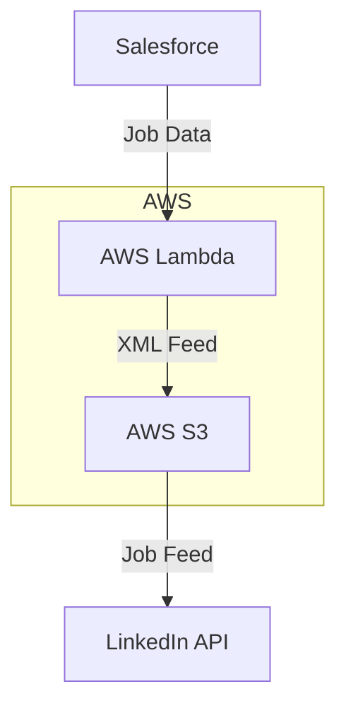
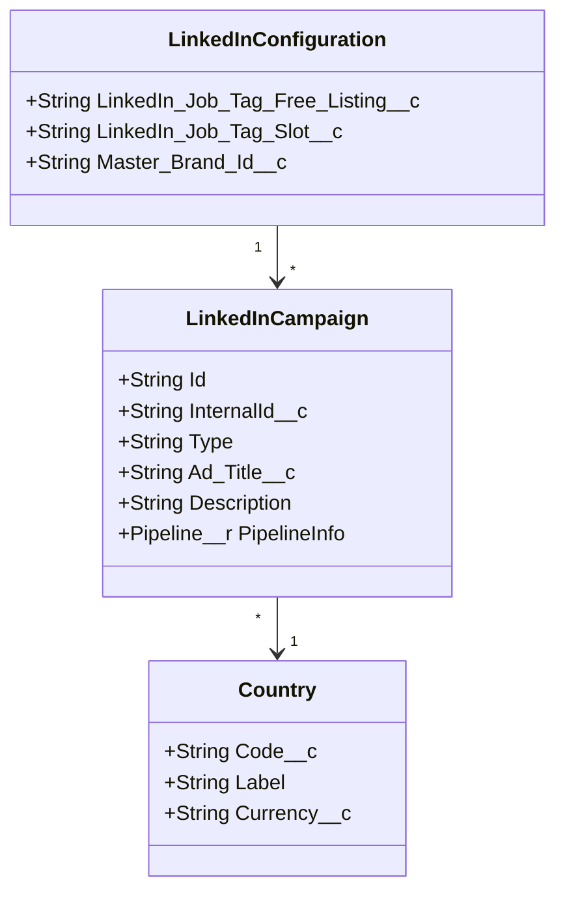

# Context Pack - Crossover: Hire - L2 - Sourcing - LinkedIn

## Business Context

The LinkedIn Sourcing module enables Crossover to efficiently post and manage job listings on LinkedIn's platform. It addresses the need to reach high-quality professional candidates through LinkedIn's job marketplace, supporting both free job listings and paid job slots. The module automatically synchronizes job postings from Crossover's internal systems to LinkedIn, ensuring consistent and up-to-date job information across platforms.

## Functional Context

The module provides automated job feed generation and publishing capabilities for LinkedIn integration. Key functions include:

- Generating XML job feeds compatible with LinkedIn's bulk job posting API
- Supporting both free job listings and paid job slots
- Handling location-based and remote job postings
- Managing job metadata including skills, experience levels, and industries
- Tracking application sources through UTM parameters

### Important Functional Decisions

1. Support for both free listings and job slots with different tagging strategies
2. Inclusion of master brand concept for unified company representation
3. Automated handling of remote vs. location-based positions
4. Standardized job description formatting with consistent branding elements

## Technical Context

### Tech Stack

- Node.js with TypeScript
- AWS Lambda for serverless execution
- AWS S3 for feed storage
- Salesforce integration for job data
- XML processing using xmlbuilder2

### Architecture

### Data Model

### Important Technical Decisions

1. XML feed generation happens in memory before S3 upload for better performance
2. Feed generation is scheduled via CloudWatch Events
3. Separate buckets for output and access logging
4. Standardized error handling with detailed logging

### Established Practices

1. Strict type checking for LinkedIn enums (job functions, industries, etc.)
2. Comprehensive unit testing for feed generation
3. Structured logging for monitoring and debugging
4. Configuration management through Salesforce

### 3rd party services

- LinkedIn Job Posting API - Bulk job posting interface. [LinkedIn API Documentation](https://learn.microsoft.com/en-us/linkedin/talent/job-postings/api/bulk-job-postings)
- Salesforce - Source of job and configuration data. [Salesforce API Documentation](https://developer.salesforce.com/docs)

### 3rd party libraries

- xmlbuilder2 - XML generation library. [Documentation](https://oozcitak.github.io/xmlbuilder2/)
- luxon - DateTime handling. [Documentation](https://moment.github.io/luxon/)

## Functions

1. LinkedIn Feed Generation - Generates and uploads XML feed for LinkedIn job postings. [L3 Document]
2. LinkedIn Data Service - Manages data retrieval and transformation from Salesforce. [L3 Document]
3. Feed Upload Service - Handles S3 upload of generated feeds. [L3 Document]
