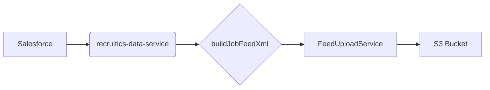

# Context Pack - Crossover: Hire - L2 - Sourcing - Recruitics

## Business Context

The "Sourcing - Recruitics" module is responsible for generating a Recruitics job feed, which is an XML file containing job postings that can be used by Recruitics to post these jobs on various job boards. This module is crucial for attracting talent and expanding the reach of job postings.

## Functional Context

The module fetches relevant data from Salesforce, which includes job postings, country information, and campaign details. It then uses this data to build a Recruitics job feed XML file. This file is then uploaded to an S3 bucket for later use by Recruitics.

Users can interact with the module by triggering the Lambda function that generates the feed. This function can be triggered manually or automatically based on a schedule. Other modules interact with this module by accessing the generated feed file from the S3 bucket.

### Important Functional Decisions

- **Data source:** The decision to use Salesforce as the primary data source was made due to its availability and reliability.
- **XML format:** The Recruitics job feed format is standardized and requires specific XML elements. This decision ensures compatibility with Recruitics platform.
- **S3 bucket storage:** The S3 bucket provides a secure and scalable storage solution for the generated feed files.

## Technical Context

### Tech Stack

- **Node.js:** Used for writing the Lambda function and related services.
- **Salesforce:** Used as the data source for job postings and related information.
- **@trilogy-group/xoh-integration:** A package providing a client library for interacting with Salesforce.
- **xmlbuilder:** Used for generating the XML feed file.
- **AWS Lambda:** The function that orchestrates the data fetching, feed generation, and file upload processes.
- **AWS S3:** Used to store the generated Recruitics job feed XML file.

### Architecture

The architecture diagram illustrates the flow of data and actions:

1.  **Salesforce:** The primary data source for job postings, country information, and campaign details.
2.  **recruitics-data-service:** A service responsible for fetching data from Salesforce and providing it to the feed builder.
3.  **buildJobFeedXml:** The function responsible for constructing the Recruitics job feed XML file from the data received from `recruitics-data-service`.
4.  **FeedUploadService:** A service responsible for uploading the generated XML feed file to the S3 bucket.
5.  **S3 Bucket:** The final storage location for the generated XML feed file.

### Data Model

- **Campaign:** Represents a campaign in Salesforce containing information about the job posting, including title, description, location, and associated pipeline details.
- **Country:** Represents a country in Salesforce, containing information such as country code, label, currency code, exchange rate, and currency symbol.

### Important Technical Decisions

- **Data fetching from Salesforce:** The `recruitics-data-service` efficiently queries the necessary data using SOQL queries.
- **XML structure:** The `buildJobFeedXml` function adheres to the Recruitics job feed XML specification, ensuring proper data formatting.
- **S3 upload mechanism:** The `FeedUploadService` employs asynchronous uploads to improve performance.

### Established Practices

- **Error handling:** Robust error handling is implemented throughout the module to handle unexpected exceptions and ensure data integrity.
- **Logging:** Detailed logs are generated to track the execution flow and identify potential issues.

### 3rd party services

- **Recruitics:** A third-party service used for posting jobs on various job boards.
- **AWS:** Used for various services, including Lambda, S3, and DynamoDB.

### 3rd party libraries

- **@trilogy-group/xoh-integration:** Provides a client library for interacting with Salesforce.
- **xmlbuilder:** Provides a library for generating XML files.

## Functions

- **recruitics-feed-generator.ts:** The Lambda function responsible for triggering the data fetch, feed generation, and S3 upload process. (Link to L3: [recruitics-feed-generator.ts](recruitics-feed-generator.ts))
- **recruitics-data-service.ts:** Provides functions for fetching data from Salesforce. (Link to L3: [recruitics-data-service.ts](recruitics-data-service.ts))
- **recruitics-feed-builder.ts:** Constructs the Recruitics job feed XML file. (Link to L3: [recruitics-feed-builder.ts](recruitics-feed-builder.ts))
- **feed-upload-service.ts:** Uploads the generated XML feed file to the S3 bucket. (Link to L3: [feed-upload-service.ts](feed-upload-service.ts))
