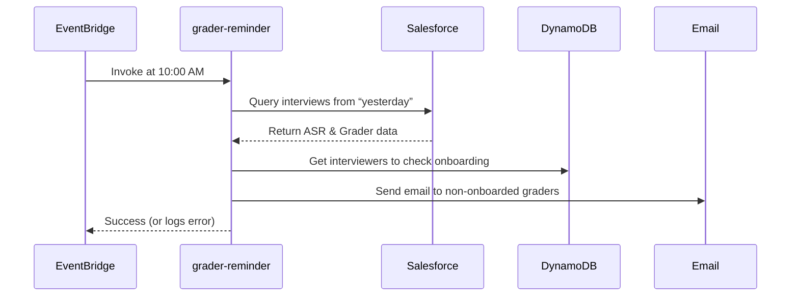

# Context Pack - Crossover: Hire - L3 - Interview Assistant - Daily grader reminder

## Business Context

A daily email notification system reminds interviewers who conducted an interview the previous day (and are not yet onboarded) to enable Read AI integration. This automated feature ensures more complete interview data, more accurate transcript captures, and richer feedback for hiring decisions, aligning with the Interview Assistant’s goal of streamlining the interview process.

## Functional Context

- Queries Salesforce for interviews scheduled from “yesterday.”
- Excludes canceled interviews to avoid sending reminders for no-shows.
- Checks who is “onboarded” (i.e., we’ve seen at least one transcript from them).
- Emails interviewers who have no transcripts / are not onboarded, reminding them to set up Read AI.
- Supports a “dry run” mode to log reminders instead of sending them (controlled by Config.sendReminderEmail).
- Runs automatically once per day at a configurable time via EventBridge scheduler.

### Important Functional Decisions

1. Only one email per interviewer per day, even if multiple interviews occurred.
2. A new `dailyReminderEnabled` flag in the `InterviewAssistConfiguration` toggles whether the reminder function is scheduled.
3. A new `sendReminderEmail` flag in the `Config` object toggles whether the reminder email is sent, or just logged.
4. Logic for determining “onboarded” interviewers is stored in DynamoDB → if we have a record with “isOnboarded: true,” or at least one transcript has come from that interviewer.
5. The body of the email includes step-by-step instructions for enabling the Read AI webhook.
6. The system uses nodemailer (via AWS SES in production) for sending the reminder.

## Technical Context

### Tech Stack

• Node.js 20.x, AWS Lambda  
• AWS EventBridge (CloudWatch schedule) for daily invocation  
• AWS DynamoDB for storing interviewer data (isOnboarded flag)  
• AWS SES / nodemailer for email sending  
• Salesforce (via @trilogy-group/xoh-integration) to query interviews from the day before

### Architecture

### Data Model

In DynamoDB, an interviewer document looks like:

- pk = "INTERVIEWER"
- sk = _**\<interviewerId>**_
- isOnboarded: `Boolean`

An `InterviewAssistConfiguration` object (in CDK) includes:

- dailyReminderEnabled: `Boolean` (toggles the Lambda’s EventBridge rule)

An `Config` object (in DynamoDB) includes:

- sendReminderEmail: `Boolean` (controls dry run vs. actual sending)

### Important Technical Decisions

1. The Lambda tracks canceled vs. non-canceled interviews by referencing the `CalendlyAction__c` object in Salesforce.
2. By design, if no config is found or `config.sendReminderEmail === false`, the code logs emails instead of sending them to avoid accidental spamming (dry run mode).
3. The email body references a `Read AI integration` setup link and privacy notice to reassure interviewers.

### Established Practices

- **Logging**: The function logs daily run details, including how many emails are sent or skipped.
- **Error Handling**: If the function fails querying Salesforce or hits an unexpected error, it logs the exception. Emails for unaffected interviewers can still proceed.
- **Idempotency**: Each day the function runs fresh queries for “yesterday,” so no complicated state management is needed.

### 3rd Party Services

• Salesforce: Queries for interview data (`CalendlyAction__c`, `Application_Step_Result__c`).  
• nodemailer / AWS SES: Composes and sends reminder emails.

### 3rd Party Libraries

• `@aws-sdk/\*` for DynamoDB and various AWS interactions.  
• `@trilogy-group/xoh-integration` for Salesforce queries.  
• `luxon` for date handling.  
• `nodemailer` for sending emails (in place of direct AWS SES calls).

## Files

1. `packages/interview-assist/src/handlers/grader-reminder.ts`: Core logic to query Salesforce, filter onboarded interviewers, and send email.
2. `packages/interview-assist/src/handlers/grader-reminder.test.ts`: Unit tests verifying correct generation of reminder emails and dry run.
3. `deploy/src/deployments/interview-assist/interview-assist-deployment.ts`: `EventBridge` rule creation. Schedules the `grader-reminder` Lambda daily if `dailyReminderEnabled` is true.
4. `packages/interview-assist/src/models/interviewer.ts`: Defines the `isOnboarded = true/false` for interviewers.
5. `packages/interview-assist/src/models/config.ts`: The `sendReminderEmail` property controlling dry run vs. real email mode.
