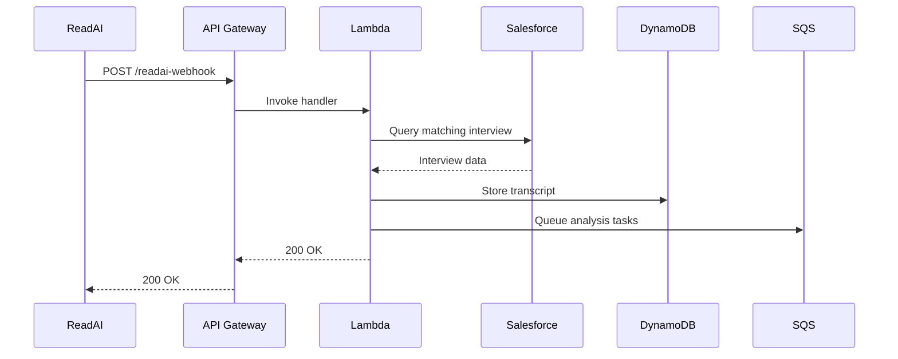

# Context Pack - Crossover: Hire - L3 - Interview Assistant - ReadAI Webhook Handler

## Business Context

The ReadAI Webhook Handler serves as a critical integration point that processes interview transcripts from Read.AI. It addresses key business needs:

- Automated capture of interview transcripts to ensure complete interview records
- Reliable matching of transcripts to corresponding interviews in the system
- Initial processing of interview data for subsequent analysis tasks
- Supporting data-driven interview feedback and quality assessment

## Functional Context

The webhook handler acts as an entry point for interview transcript data by:

1. Receiving webhook payloads from Read.AI containing interview metadata and transcripts
2. Identifying and matching transcripts to interviews using multiple matching strategies:
   - Grader ID-based matching
   - Email-based matching (interviewer and candidate emails)
3. Storing transcript data and triggering analysis pipelines
4. Managing duplicate transcripts through session-based identifiers

### Important Functional Decisions

1. Multiple matching strategies:

   - Primary: Grader ID with candidate email verification
   - Fallback: Email-based matching using interviewer and candidate emails
   - Time-proximity validation within 2 days threshold

2. Always return 200 OK response to prevent webhook retries
3. Store duplicate transcripts with session IDs for potential recovery

## Technical Context

### Tech Stack

- AWS Lambda (Node.js) - Serverless compute
- Amazon DynamoDB - Transcript storage
- AWS API Gateway - Webhook endpoint
- AWS SQS - Async task processing
- Salesforce API - Interview data integration

### Architecture



### Data Model

```mermaid
erDiagram
    ReadAiTranscript {
        string pk "TRANSCRIPT#READAI"
        string sk "id"
        string asrId "Interview ASR ID"
        json payload "Raw webhook payload"
        string createdAt "Timestamp"
        string updatedAt "Timestamp"
    }
```

### Important Technical Decisions

1. Reliable transcript matching using:
   - Multiple time fields (scheduled/started)
   - Time proximity threshold (2 days)
   - Flexible null handling
2. Asynchronous processing:
   - Immediate data storage
   - Queued analysis tasks
   - Independent error handling

### Established Practices

1. Error handling:

   - Log all errors without affecting response
   - Store duplicate transcripts with session IDs
   - Comprehensive error logging

2. Data validation:
   - Validate webhook payload structure
   - Verify interview matching criteria
   - Handle edge cases (missing data)

### 3rd party services

- Read.AI Webhook API - Interview transcription service
- Salesforce API - Interview record management

### 3rd party libraries

- @trilogy-group/xoh-integration - Salesforce integration utilities
- dynamodb-toolbox - DynamoDB data modeling
- luxon - DateTime handling

## Files

- readai-webhook.ts - Main webhook handler implementation
- readai-webhook.test.ts - Handler test suite
- read-ai-transcript.ts - DynamoDB model and operations
- dynamodb.ts - Database client configuration
- sqs.ts - Message queue client
