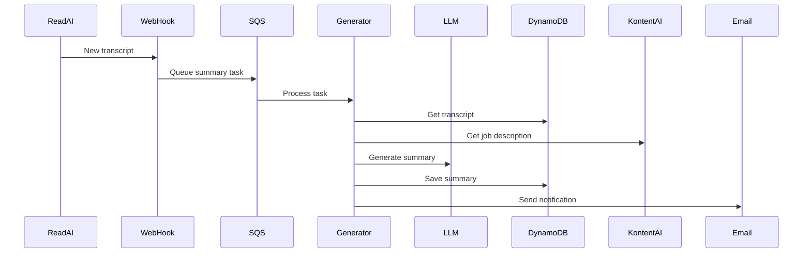

Based on the provided information, I'll create an L3 context pack for the "Summary Generation" function within the Interview Assistant module.

# Context Pack - Crossover: Hire - L3 - Interview Assistant - Summary Generation

## Business Context

The Summary Generation function is a critical component of the Interview Assistant that analyzes interview transcripts and generates comprehensive summaries. It addresses the core business problems of:

1. Inadequate interview feedback by providing structured, detailed analysis
2. Misalignment between candidate qualifications and job requirements through automated matching
3. Inefficient use of interviewer time by automating the summary generation process

## Functional Context

The function processes interview transcripts in two ways:

1. Automatically when triggered by new Read.AI transcripts through SQS:
   - Supports grader-specific webhook URLs (`/readai-webhook/{graderId}`)
   - Validates transcript matches with both email and grader ID
2. On-demand through a REST API endpoint for testing/preview purposes:
   - Supports both JSON and plain text responses
   - Configurable prompt versions

The summary generation includes:

1. Basic analysis (v1):

   - Job positioning/explanation to candidate
   - Questions and answers summary
   - Candidate's achievements and expert insights

2. Advanced analysis (v2):
   - Enhanced markdown formatting for better readability
   - Structured section headers with proper hierarchy
   - Detailed requirements matching
   - Skills/experience gap analysis
   - Concrete examples and evidence focus

### Email Notifications

1. Interview Summary Emails:

   - Rich HTML format with responsive design
   - Markdown-to-HTML conversion for formatted content
   - Direct links to Read.AI recording and grading
   - Structured sections for better readability

2. Grader Reminder Emails:
   - HTML template with styled sections
   - Setup instructions with webhook URL
   - Integration benefits and privacy notices
   - FAQ section

### Important Functional Decisions

1. Asynchronous processing via SQS to handle long-running LLM operations
2. Configurable prompts stored in DynamoDB to support different analysis types
3. Saving of generated summaries to DynamoDB
4. Integration with Kontent.ai for job description data
5. HTML email templates with markdown support

## Technical Context

### Tech Stack

- AWS Lambda for processing
- Amazon SQS for async task handling
- DynamoDB for data storage
- AI providers (OpenAI/Amazon Bedrock) for text generation
- Kontent.ai for job description data

### Architecture

### Important Technical Decisions

1. Using an AI provider abstraction layer to support multiple LLM providers
2. Storing prompt configurations in DynamoDB for flexibility
3. Using Handlebars for both prompt and email templating
4. Converting markdown to HTML for email formatting
5. Supporting both grader-specific and general webhook endpoints

### Established Practices

1. Error handling:
   - Failed tasks moved to DLQ after 3 retries
   - Correlation IDs for tracking
2. Data storage:
   - SUMMARY#{transcriptId} for primary key pattern
   - Timestamps for auditing

### 3rd party services

- OpenAI API - Primary text generation service
- Amazon Bedrock - Alternative AI provider
- Kontent.ai - Job description content management

### 3rd party libraries

- @ai-sdk/provider - AI provider abstraction layer
- @ai-sdk/openai - OpenAI integration
- @ai-sdk/amazon-bedrock - Amazon Bedrock integration
- handlebars - Template rendering
- marked - Markdown to HTML conversion
- nodemailer - Email sending

## Files

- `src/tasks/generate-summary.ts` - Core summary generation logic
- `src/handlers/tasks-processor.ts` - SQS message processor
- `src/handlers/generate-summary-rest.ts` - REST API handler
- `src/models/summary.ts` - Summary data model
- `src/models/prompt.ts` - Prompt configuration model
- `src/integrations/llm.ts` - AI provider integration
