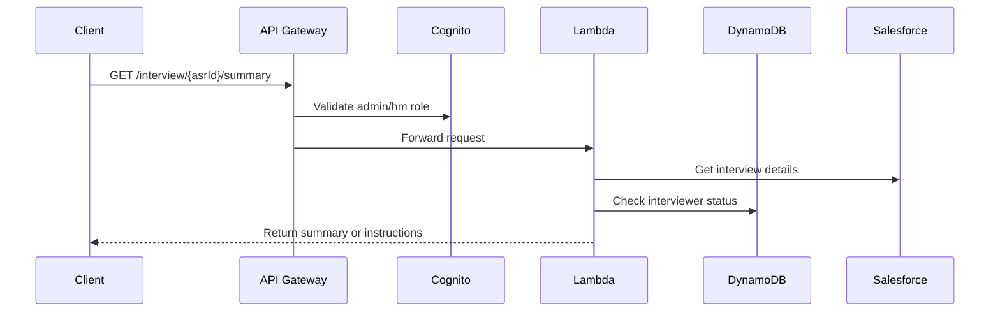

# Context Pack - Crossover: Hire - L3 - Interview Assistant - Summary Retrieval API

## Business Context

The Summary Retrieval API provides secure access to interview summaries while guiding the onboarding process for new interviewers. It addresses key business needs:

1. Secure access to interview data for authorized personnel (admins/HMs)
2. Streamlined onboarding guidance for new interviewers to setup Read.ai webhook
3. Centralized access to interview summaries and recordings

## Functional Context

The API handles two main scenarios:

1. Onboarded Interviewers:

   - Returns interview summary if available
   - Includes Read.ai recording URL

2. Non-onboarded Interviewers:
   - Returns personalized setup instructions which includes grader-specific webhook URL

### Important Functional Decisions

1. Admin/HM-only access to protect interview data
2. Personalized webhook URLs per grader for easier setup
3. Comprehensive setup instructions with benefits and FAQ
4. Clear error states for various scenarios (missing ASR, no summary yet, etc.)

## Technical Context

### Tech Stack

- AWS Lambda (Node.js 20.x)
- API Gateway with Cognito authorizer
- DynamoDB for summary storage
- Salesforce for grader data
- Handlebars for output templating

### Architecture

### Data Model

1. Summary Document in DynamoDB:

   - pk = "SUMMARY"
   - sk = _**\<asrId>**_
   - summary: String
   - reportUrl: String

2. API Response:
   - isOnboarded: Boolean
   - summary?: String
   - readAiUrl?: String
   - instructions?: String

### Important Technical Decisions

1. Cognito authorization for admin/HM roles only
2. CORS enabled for frontend integration
3. Handlebars templating for personalized instructions
4. Clear separation between onboarded/non-onboarded flows

### Established Practices

- **Authorization**: Cognito groups validation
- **Error Handling**: Structured error responses with appropriate HTTP codes
- **Logging**: Consistent logging of access and error cases
- **CORS**: Configured for frontend access

### 3rd Party Services

- AWS Cognito: Authentication and authorization
- Salesforce: Interview and grader data
- DynamoDB: Summary storage

### 3rd Party Libraries

- `@trilogy-group/xoh-integration`: Salesforce integration
- `handlebars`: Template rendering
- AWS SDK for DynamoDB operations

## Files

1. `src/handlers/get-summary.ts`: Main API handler with authorization and logic flow
2. `src/handlers/get-summary.instructions.ts`: Setup instructions template
3. `deploy/.../interview-assist-deployment.ts`: API Gateway and Lambda configuration
4. `src/models/summary.ts`: DynamoDB operations for summaries
5. `src/models/interviewer.ts`: Interviewer status management
