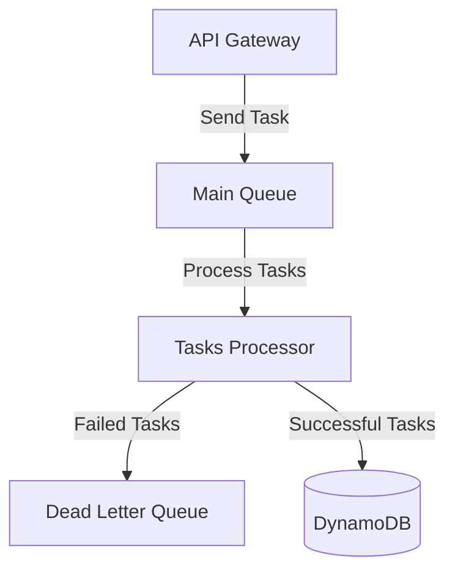
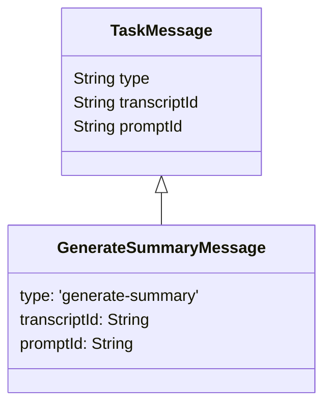

# Context Pack - Crossover: Hire - L3 - Interview Assistant - Tasks Processing

## Business Context

The Tasks Processing function handles the asynchronous processing of interview-related tasks, primarily focusing on transcript analysis and summary generation. It ensures reliable and scalable handling of interview data processing, with built-in retry mechanisms for failed operations to maintain system reliability.

## Functional Context

Tasks Processing operates as a background service that:

- Receives and processes interview-related tasks asynchronously
- Handles summary generation requests for interview transcripts
- Manages failed tasks through a dead-letter queue mechanism
- Provides reliable task execution with automatic retries

### Important Functional Decisions

1. Tasks are processed asynchronously to avoid blocking API responses
2. Failed tasks are retried up to 3 times before being moved to DLQ
3. Batch processing is enabled with a size of 10 messages for optimal throughput

## Technical Context

### Tech Stack

- AWS SQS for message queuing
- AWS Lambda for task processing
- Node.js 20.x runtime environment

### Architecture

### Data Model

### Important Technical Decisions

1. Using SQS for task queuing:

   - Provides reliable message delivery
   - Built-in retry mechanism
   - Dead letter queue support
   - Cost-effective for varying workloads

2. Lambda batch processing configuration:
   - Batch size: 10 messages
   - Visibility timeout: 16 minutes
   - Maximum retries: 3 attempts

### Established Practices

1. Tasks should be idempotent to handle potential retries
2. Failed tasks are moved to DLQ after 3 retry attempts
3. Task processing errors are logged for monitoring

### 3rd party services

- AWS SQS - Message queuing service used for task processing

### 3rd party libraries

- @aws-sdk/client-sqs - AWS SQS client library for queue operations
- @trilogy-group/xoh-integration - Shared utilities for logging and integration

## Files

1. tasks-processor.ts - Main Lambda handler for processing tasks from SQS
2. messages.ts - Defines message types and interfaces for task processing
3. sqs.ts - SQS integration utilities for sending tasks
4. generate-summary.ts - Implementation of summary generation task
