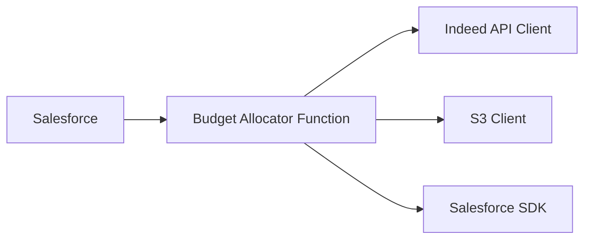

# Context Pack - Sourcing Manager - L3 - Sourcing - Indeed - Budget Allocator

## Business Context

The "Sourcing - Indeed - Budget Allocator" feature is responsible for allocating budget to Indeed sponsoring campaigns based on the pipeline budget and campaign placement.

This feature ensures that the budget is distributed proportionally across different pipelines and campaign groups, maximizing the efficiency of Indeed's paid advertising platform. It also helps to optimize the allocation of budget based on the remaining time until the campaign end date.

## Functional Context

The Budget Allocator function runs periodically, typically on a weekly basis. It retrieves the following data from Salesforce:

1.  **Pipeline budget:** Fetches the total budget allocated to each pipeline for the sourcing week.
2.  **Campaign information:** Fetches the details of all active Indeed campaigns, including their placement (country, region, or pipeline-specific groups) and associated pipeline information.
3.  **Job board cell analytics:** Retrieves the latest data on the performance of the job board cells for each campaign.

Based on the collected data, the function performs the following operations:

1.  **Budget calculation:** Calculates the budget allocation for each campaign group based on the pipeline budget and the number of job ads within the group. The budget is adjusted proportionally based on the number of days remaining until the campaign end date.
2.  **Campaign updates:** Updates the budget and end date of existing Indeed sponsoring campaigns or creates new campaigns based on the calculated budget allocation and the remaining time until the campaign end date.
3.  **Campaign status:** Pauses all active campaigns before allocating the budget for the upcoming sourcing week.
4.  **Data export:** Exports the campaign information, including analytics data, to an S3 bucket in a CSV format.

## Important Functional Decisions

- **Weekly budget allocation:** The budget allocation is calculated on a weekly basis, allowing for flexible adjustments based on campaign performance and remaining time.
- **Budget multiplier:** The budget multiplier ensures that the budget is distributed proportionally based on the number of days remaining until the campaign end date.
- **Data export to S3:** The export of campaign data to an S3 bucket provides a centralized and readily accessible data source for analysis and reporting.

## Technical Context

### Tech Stack

- **Node.js:** The Budget Allocator function is written in Node.js.
- **Salesforce SDK:** The code utilizes the Salesforce SDK to interact with the Salesforce platform.
- **AWS SDK:** The code interacts with AWS services such as S3 for data storage and export.
- **Indeed API Client:** The function uses a custom Indeed API client library to interact with the Indeed API.
- **Luxon:** Used for date and time manipulation.
- **CSV-Stringify:** Used for CSV data generation.

### Architecture

### Data Model

The function relies on the following data models from Salesforce:

- **Campaign:** Represents an individual job advertisement on Indeed.
- **Job_Board_Cell:** Represents a specific job board cell, linking to a location.
- **Location:** Represents a geographical location, with information about country, region, and division.
- **Pipeline:** Represents a job requisition, with information about the budget, brand, and family.
- **Job_Board_Cell_Analytics:** Contains analytics data associated with a particular job board cell.

### Important Technical Decisions

- **API Client:** Using a custom Indeed API client library simplifies the interaction with the Indeed API, providing a consistent and well-defined interface.
- **Data Caching:** The code utilizes caching mechanisms for frequently accessed data, such as Salesforce objects and Indeed API responses, to improve performance.
- **Error Handling:** Robust error handling is implemented throughout the code to ensure the function's stability and resilience.

### Established Practices

- **Logging:** The code includes extensive logging to track the execution flow, identify errors, and provide valuable insights.
- **Unit Tests:** The function is thoroughly tested with unit tests to ensure the code's correctness and reliability.

### 3rd party services

- **Salesforce:** Salesforce is used for managing data related to pipelines, campaigns, and job board cells.
- **Indeed API:** The Indeed API is used to manage and update sponsoring campaigns on Indeed.
- **S3:** S3 is used for storing and exporting campaign data in a CSV format.

### 3rd party libraries

- **@trilogy-group/xoh-integration:** Provides utility functions for interacting with Salesforce, Secrets Manager, and logging.
- **luxon:** Provides date and time manipulation functionalities.
- **csv-stringify:** Provides functionalities for generating CSV data.

## Files

- **packages/sourcing-manager/src/handlers/indeed-allocate-budget.ts:** Main function responsible for allocating budget to Indeed sponsoring campaigns. [link to file](https://github.com/your-repo/sourcing-manager/blob/master/src/handlers/indeed-allocate-budget.ts)
- **packages/sourcing-manager/src/services/indeed-data-service.ts:** Contains utility functions for interacting with Salesforce and Indeed API, retrieving campaign and analytics data. [link to file](https://github.com/your-repo/sourcing-manager/blob/master/src/services/indeed-data-service.ts)
- **packages/sourcing-manager/src/integrations/indeed.ts:** Contains the Indeed API client library and related types. [link to file](https://github.com/your-repo/sourcing-manager/blob/master/src/integrations/indeed.ts)
- **packages/sourcing-manager/src/utils/common.ts:** Contains utility functions for common tasks like grouping arrays and chunking lists. [link to file](https://github.com/your-repo/sourcing-manager/blob/master/src/utils/common.ts)
