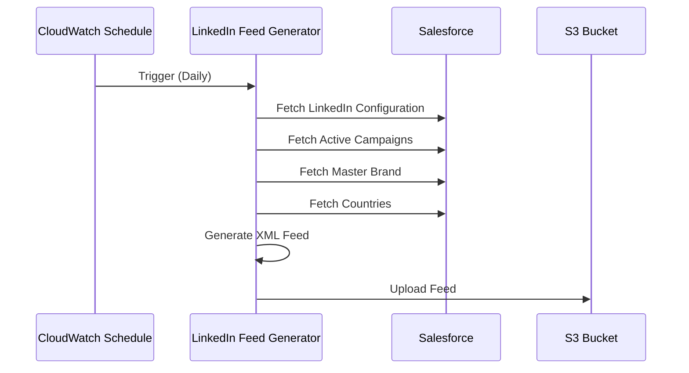
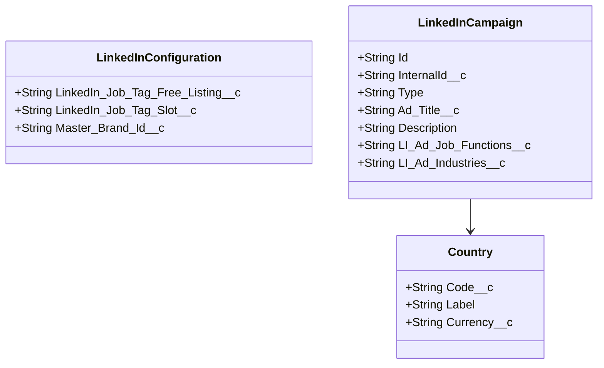

# Context Pack - Crossover: Hire - L3 - Sourcing Manager - LinkedIn - Feed Generation

## Business Context

This function generates XML job feed for LinkedIn's jobs platform to post job ads from Crossover. It enables the organization to efficiently publish and manage job listings on LinkedIn, supporting both free listings and job slots. The function serves hiring managers and recruiters by automating the job posting process on LinkedIn.

## Functional Context

The function operates automatically on a schedule, fetching active LinkedIn job campaigns from Salesforce, transforming them into LinkedIn's required XML format, and uploading the feed to an S3 bucket. The feed includes comprehensive job details such as titles, descriptions, company information, locations, skills, and salary data.

### Important Functional Decisions

- Support both LinkedIn free listings and job slots with different tagging strategies
- Include master brand capability to override individual brand settings when needed
- Implement one-click apply functionality where applicable
- Support remote, hybrid, and on-site workplace types based on geographic restrictions

## Technical Context

Feed Format URL: https://content.linkedin.com/content/dam/help/linkedin/en-us/LinkedIn_Jobs_XML_Development_Guide.pdf

### Tech Stack

- Node.js Lambda function
- AWS S3 for feed storage
- Salesforce integration for job data
- XML generation using xmlbuilder2
- Luxon for date handling

### Architecture

### Data Model

### Important Technical Decisions

- Implement strict validation for required fields before including jobs in the feed
- Use CDATA sections in XML to handle special characters in job descriptions
- Support multiple job functions and industries through mapping tables
- Implement error handling per campaign to prevent single campaign failures from affecting the entire feed

### Established Practices

- The feed is generated daily and uploaded to a specific S3 bucket path (linkedin/linkedin-jobs-feed.xml)
- Dry run capability through DRY_RUN environment variable
- Extensive logging of processing steps and validation errors

### 3rd party services

- Salesforce - Source of job campaign data and configuration
- LinkedIn Jobs - Consumes the generated XML feed for job postings

### 3rd party libraries

- xmlbuilder2 - XML generation library for creating LinkedIn-compatible feed format
- luxon - Date/time handling library for generating RFC2822 compliant dates

## Files

- linkedin-feed-generator.ts - Main handler for generating LinkedIn XML feed
- linkedin-data-service.ts - Service for fetching and managing LinkedIn-related data from Salesforce
- feed-upload-service.ts - Service for uploading generated feeds to S3
- linkedin-feed-generator.test.ts - Test suite for the feed generator functionality
