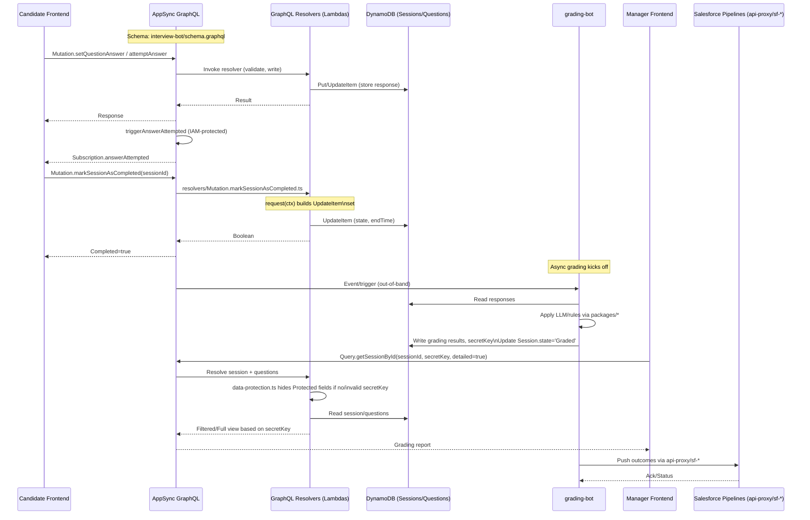

# Interview System Flow Diagrams

This document contains visual diagrams of the interview system, grounded to the repository paths and components.

- Schema: `interview-bot/schema.graphql`
- Resolvers: `interview-bot/graphql-resolvers/src/resolvers/*`
- Data protection: `interview-bot/graphql-resolvers/src/utils/data-protection.ts`
- Grading: `grading-bot/src/*`, shared: `packages/*`
- Deploy stacks: `deploy/src/deployments/*`, config: `deploy/src/config/*`

## System Architecture

```mermaid
flowchart LR
  subgraph FE[Candidate/Manager Frontends]
    FE1[Interview App (Candidate)]
    FE2[Manager App]
  end

  FE1 -->|GraphQL queries/mutations| APPSYNC[(AWS AppSync GraphQL)]
  FE2 -->|GraphQL queries with secretKey| APPSYNC

  subgraph RES[GraphQL Resolvers (Lambda)]
    R1[Query/Mutation Resolvers\ninterview-bot/graphql-resolvers/src/resolvers/*]
    DP[Field-level Data Protection\ninterview-bot/graphql-resolvers/src/utils/data-protection.ts]
  end

  APPSYNC --> R1
  R1 -->|DynamoDB API| DDB[(DynamoDB - Sessions/Questions)]
  R1 -->|Subscriptions| APPSYNC

  subgraph GRADING[Automated Grading]
    GB[grading-bot/src/*]
    PKG1[packages/beginner-mind-grader/]
    PKG2[packages/interview-assist/]
  end

  R1 <-->|read/write results, state=Graded, secretKey| GB
  GB --> PKG1
  GB --> PKG2
  GB -->|logs/metrics| CW[(CloudWatch)]

  subgraph INTEGRATIONS[Integrations & Ops]
    APIX[api-proxy/]
    SFAPI[sf-api/]
    SFUP[sf-updater/]
    SFPR[sf-process-raw-applications/]
    SFEX[sf-exceptions-proxy/]
    OPS1[stats-tracker/]
    OPS2[site-recacher/]
    OPS3[sandbox-refresh/]
    OPS4[s3-cleanup/]
    OPS5[s3-csv-split/]
    OPS6[terminated-partners/]
    OPS7[watcher/]
  end

  GB -->|graded outcomes| APIX
  APIX -->|Salesforce sync| SFAPI & SFUP & SFPR & SFEX

  subgraph INFRA[AWS CDK Stacks]
    CDK[deploy/src/deployments/*\nconfigs: deploy/src/config/*]
    S3[(S3)]
    VPC[(VPC)]
  end

  CDK --- APPSYNC
  CDK --- RES
  CDK --- DDB
  CDK --- S3
  CDK --- GRADING
  CDK --- INTEGRATIONS

  note right of APPSYNC
    Schema: interview-bot/schema.graphql\n    Enforces types, subscriptions, auth
  end

  R1 --> DP
  DP --> APPSYNC
```

## End-to-End Sequence


