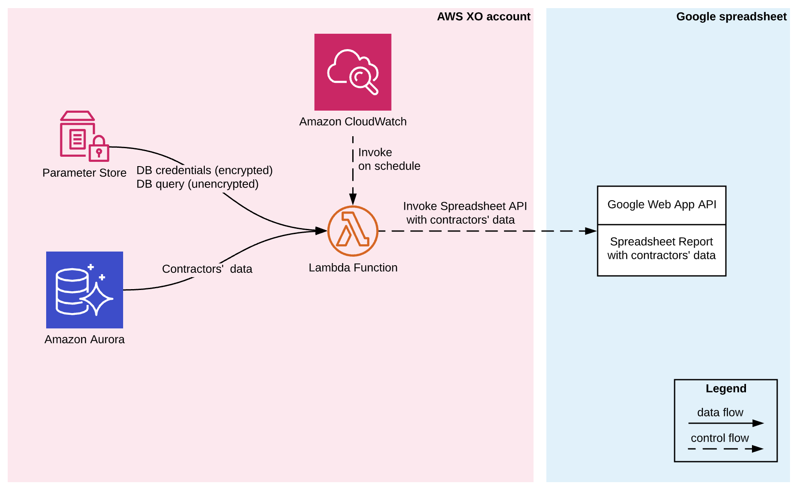

## XO Reports AWS Solution

The purpose of this solution is to periodically publish data from AWS Aurora database to a Google spreadsheet.

It is agnostic of the data that it populates and the spreadsheet. Configuration changes, like updating SQL query, are done in AWS ParameterStore and do not require redeployment.

A new report can be added by creating a new CloudWatch event and defining new configuration in the ParameterStore.

### Solution diagram



#### AWS CloudWatch

Has report’s generations schedule, invokes Lambda on schedule

#### AWS ParameterStore

Service similar to Secrets Manager, but allows to edit the stored parameters.
Has 3 parameters:

- SQL query, Spreadsheet API endpoint, sheet name [not encrypted]
- db config [encrypted]
- Google Account credentials [encrypted]

#### AWS Aurora

XO database.

#### AWS Lambda

Requests data from Aurora and passes to Spreadsheet API. No data processing.

#### XO Report Spreadsheet API

Google script exposed as an API.

All it does is populate a spreadsheet with the data it receives.
Data is appended to the bottom of the sheet. New rows are only added if there are no rows with such Primary Key.
Data is added starting from the first column, following the order defined in which it was received.
It means that spreadsheet mimics the order of fields in the original SQL query.

### Invocation flow

```
CloudWatch ->
	Lambda ->
		Parameter Store
		Aurora
		XO Reports Spreadsheet API
```

## Terminated Partners Report

Google Spreadsheet report for `Terminated Partners`.

Consists of:

- Terminated Partners Spreadsheet. Google sheet that stores exported contractor’s termination data.
- Application configuration in AWS Parameter Store.

### How to make changes

If you need to change the query there is no need to redeploy Lambda.
Just update the query in the ParameterStore, no need to update the spreadsheet.

### Test

If you need test this, you will need copy prod values on environments.ts to staging, because
there is no version of resources in other env.
